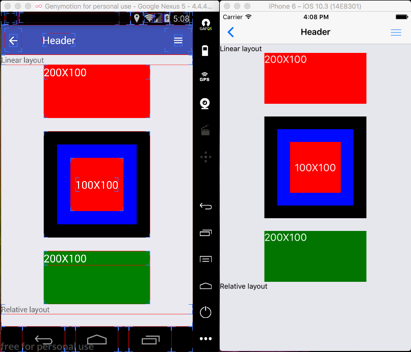

# Install
Make sure you have Node 7.6+

Install react native: https://facebook.github.io/react-native/
```
npm install -g react-native-cli
npm install -g yarn
```

Install ignite: https://github.com/infinitered/ignite
```
npm install -g ignite-cli
```

Create new application with ignite (choose full option)
```
ignite new MyApplication
```

# Docs

## Linear layout


## Flex box
- Container:
```
flexDirection:'row'|'column'
justifyContent:'flex-start'|'flex-end'|'center'|'space-between'|'space-around'
alignItems:'flex-start'|'flex-end'|'center'|'stretch'
flexWrap:'wrap'|'nowrap'
```

- Item:
```
flex
alignSelf:'auto'|'flex-start'|'flex-end'|'center'|'stretch'

```
